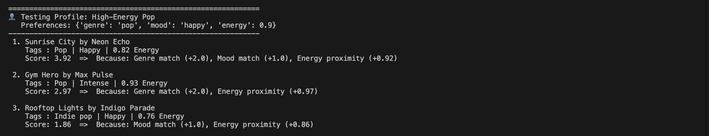
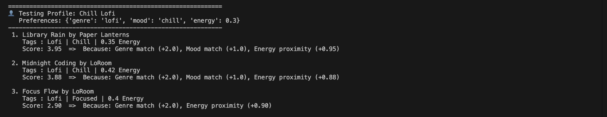
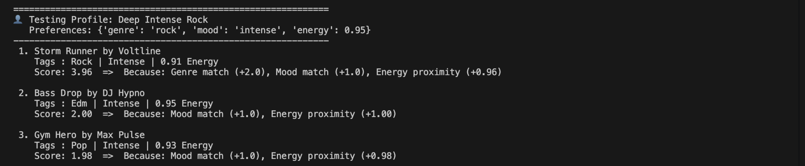

# 🎵 Music Recommender Simulation

## Project Summary

In this project, I built a simulated content-based music recommender system in Python.

The goal of this application is to emulate the algorithms used by major platforms (like Spotify or TikTok) to rank and surface music content. By parsing CSV data and establishing a weighted scoring algorithm, the program calculates the distance between a song's attributes and a user's defined "taste profile." It translates data features like genre, mood, and energy into a personalized top-K ranking, outputting explanations for why each track was chosen.

## How The System Works

This recommender uses **Content-Based Filtering**. Rather than looking at what *other users* are doing (Collaborative Filtering), it strictly evaluates the attributes of the music itself against the user's requested preferences.

### Features Utilized

- **Songs** are evaluated primarily on their `genre` (string), `mood` (string), and `energy` (float 0.0-1.0).
- **User Profiles** hold a `genre`, `mood`, and a target `energy` level.

### Algorithm Recipe

Our system iterates through the entire catalog, judging every song against the profile and awarding points:

1. **Genre Match:** +2.0 points (Heaviest weight, as genre highly dictates preference).
1. **Mood Match:** +1.0 points (Secondary priority).
1. **Energy Proximity:** Up to +1.0 point based on how close the song's energy is to the user's target. Equation: `1.0 - abs(song_energy - user_target_energy)`.

```
graph TD
    A[User Profile] --> C(Score Song Logic)
    B[songs.csv Catalog] --> C
    C --> D{Apply Weights}
    D --> E[+2.0 Genre Match]
    D --> F[+1.0 Mood Match]
    D --> G[+1.0 Energy Proximity]
    E & F & G --> H[Calculate Total Score]
    H --> I[Sort Descending]
    I --> J[Return Top K Recommendations]

```

## Getting Started

### Setup

1. Create a virtual environment (optional but recommended):

```
python3 -m venv .venv
source .venv/bin/activate      # Mac or Linux
.venv\Scripts\activate         # Windows

```
1. Install dependencies:

```
pip install -r requirements.txt

```
1. Run the app (from the root directory):

```
python3 -m src.main

```

### Running Tests

Run the starter tests with:

```
pytest

```

## Output Screenshots

*(Note: Replace these placeholders with your actual screenshots as instructed at the bottom!)*

**High-Energy Pop Profile Results**


**Chill Lofi Profile Results**


**Deep Intense Rock Profile Results**


## Experiments You Tried

- **Weight Shift:** I realized that by making `genre` worth 2.0 points, the system heavily favored genre matches over a perfect "vibe". If a user wanted "Intense Rock" but our Rock songs were low energy, it would still rank Rock higher than a high-energy Metal song.
- **Testing Divergent Needs:** I tested a profile wanting "Lofi" but with a "1.0 Energy" requirement. The system outputted an EDM song because the Energy match (+1.0) and a potential Mood match (+1.0) outweighed the missing Genre (+0.0).

## Limitations and Risks

- **Filter Bubbles:** The recommender traps users in their selected genre. Because genre grants 2 whole points, it's very difficult for the system to recommend cross-genre songs (like an energetic Hip-Hop track to an Energetic Pop listener).
- **Dataset Size:** With only 15 songs, the recommendations quickly dry up or become repetitive.
- **Hardcoded Rules:** Human taste is fluid, but our logic is rigid. It doesn't consider context (e.g., listening in the morning vs. night).

## Reflection

Read and complete `model_card.md`:
[**Model Card**](https://github.com/KelvinMathew2004/Music-Recommendation-Simulator/blob/main/model_card.md)

Building this project taught me that AI recommendation systems are essentially just complex sorting algorithms driven by weighted math. It was surprising to see how quickly a simple set of math rules (+2.0 here, +1.0 there) could make the output feel genuinely "personalized" and smart.

However, it also exposed how easily algorithms introduce bias. Because I decided that "Genre" was the most important feature (by giving it the highest point value), I unintentionally created a system that limits musical discovery. It forces users into a box based on their explicit inputs, rather than safely exploring outside of their comfort zones. This illustrates how real-world platforms can accidentally create echo chambers just through their mathematical weighting decisions.